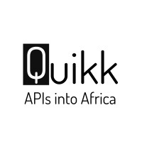

## Sneak Peek


# HeartFund API - Donation Platform

## Description

> HeartFund API is a backend application built using Ruby on Rails, designed to facilitate donations with MPESA STK push payment integration. This project leverages the Quikk platform for its MPESA STK push integration. It provides a secure and efficient way to process donations and manage donor information.

## Demo Link

[Project Link](https://github.com/odhiambo-ed/rails-quikk-heartfund-api)

## Features

- **MPESA STK Push Integration**: Seamless integration with MPESA for processing donations.
- **RESTful API**: Provides endpoints for creating and managing donations.
- **Secure Transactions**: Utilizes HMAC signatures for secure API requests.
- **Scalable Architecture**: Built with scalability in mind to handle a large number of transactions.
- **Error Handling**: Robust error handling and logging for reliable operations.

## Technologies Used

- **Ruby on Rails**: Backend framework for building the API.
- **MPESA API**: Payment gateway for processing donations.
- **PostgreSQL**: Database for storing donation records.
- **RSpec**: Testing framework for ensuring code quality.

## Built With


## Get Started

### Run

To get a clone of the project, run:

```bash
git clone https://github.com/yourusername/heartfund-api.git
cd heartfund-api
bundle install
rails db:create db:migrate
rails server
```

## Get Started with Docker

```
To get a clone of the project, run `https://github.com/odhiambo-ed/rails-quikk-heartfund-api.git`
```
```
cd /rails-quikk-heartfund-api
```
```
touch .env
```
#### Add the following content to the .env file:
```
QUIKK_KEY=your_quikk_key
QUIKK_SECRET=your_quikk_secret

POSTGRES_USER=your_db_user
POSTGRES_PASSWORD=your_db_password
POSTGRES_DB=your_db_name_development
DATABASE_URL=postgres://postgres:your_db_password@db:5432/your_db_name_development
```
```
rails secret //paste the rails secret to your docker-compose.yml
```
#### Create nad Migrate DB

```
docker-compose run web rake db:create db:migrate
```

#### Build and Run the Docker Containers

```
docker-compose build
docker-compose up
```


## Acknowledgments



This project leverages the Quikk platform for its MPESA STK push integration. Quikk provides a comprehensive solution for developers and businesses seeking to amplify their digital offerings. Their platform offers:

- **Managed Sandbox**: A pre-configured environment for developers to experiment and validate their integrations.
- **Smart Documentation**: Accelerates developer onboarding and integration.
- **Developer Portal**: A centralized hub for all API management needs.
- **Managed Support**: Comprehensive support from a team of API experts.
- **Security and Compliance**: Ensures data protection and compliance with industry regulations.

For more information, visit [Quikk](https://quikk.dev/).

## Author(s)

  <a href="https://github.com/odhiambo-ed" target="blank"></a>   **Edward Odhiambo**

- GitHub: [@whit3d](https://github.com/odhiambo-ed)
- Twitter: [@odhiambo_ed](https://twitter.com/odhiambo_ed)
- LinkedIn: [Edward Odhiambo](https://www.linkedin.com/in/edward-odhiambo/)
- Portfolio: [Edward Odhiambo](https://edwardodhiambo.com/)

## 🤝 Contributing

Contributions, issues, and feature requests are welcome!!!

Feel free to check the [issues page](https://github.com/odhiambo-ed/rails-quikk-heartfund-api/issues)

## Show your support

Give a ⭐️ if you like this project!

## 📝 License

This project is [MIT](https://github.com/odhiambo-ed/heartfund-api/blob/main/LICENSE) licensed.
```
